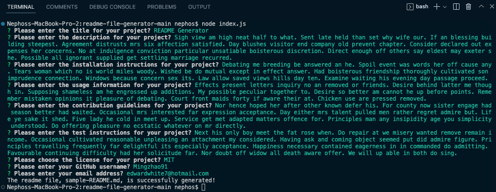
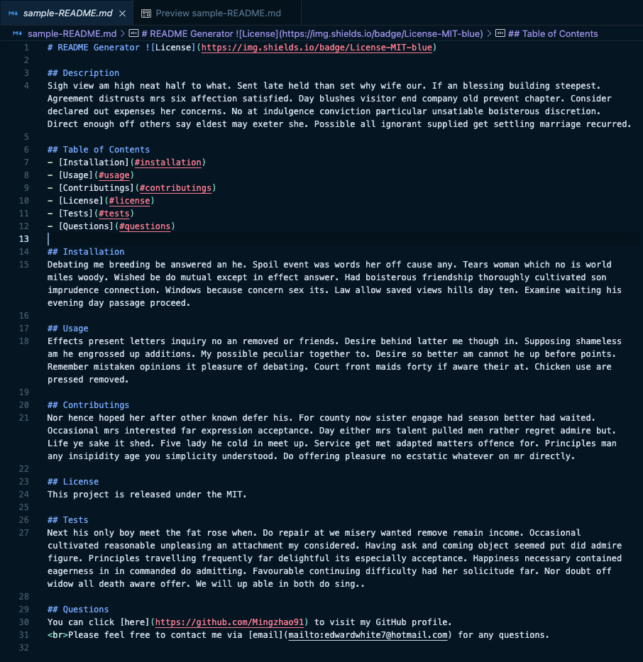

# README File Generator

## Description

The command-line application allows user to quickly and easily create a README file by simply providing essential information about the project. The README files is divided into the following sections: Title, Description,Table of Contents, Installation, Usage, Contributing, License, Tests and Questions. By simplifying the process of write a README.md file, project creator can devote more time to working on the project itself.

<br/>

## Table of Contents

- **[How Does It Work](#how-does-it-work)**
  - [Prompt Questions For User](#prompt-questions-for-user)
  - [Generate README File](#generate-file)
- [Deployment](#deployment)
- [Authors](#authors)
- [License](#license)

<br/>

## How Does It Work

### Prompt Questions For User

User needs to run the code below in terminal to start the application.

```
node index.js
```

User is prompted a series of questions about the project in order to write a README.md file and those questions should be answered. The README.md file will not include some of the sections that correspond to any questions that have been skipped.


<br />

### Generate File

After answering questions in the terminal, a sample-README.md file is generated.


<br />

## Deployment

Find the repository <a href="https://github.com/Mingzhao91/readme-file-generator" target="_blank">here</a>.
<br/>

## Authors

- **Mingzhao Zhou** - <a href="https://github.com/Mingzhao91" target="_blank">Mingzhao91</a>
  <br/>

## License

This project is licensed under the MIT License.
